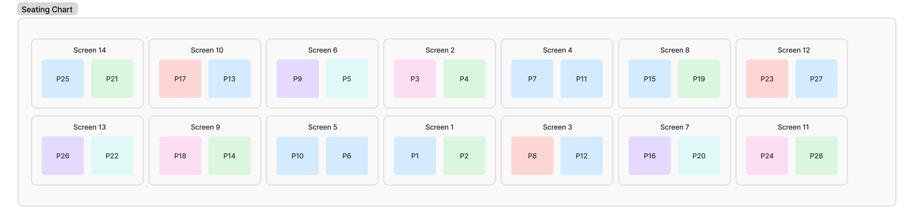
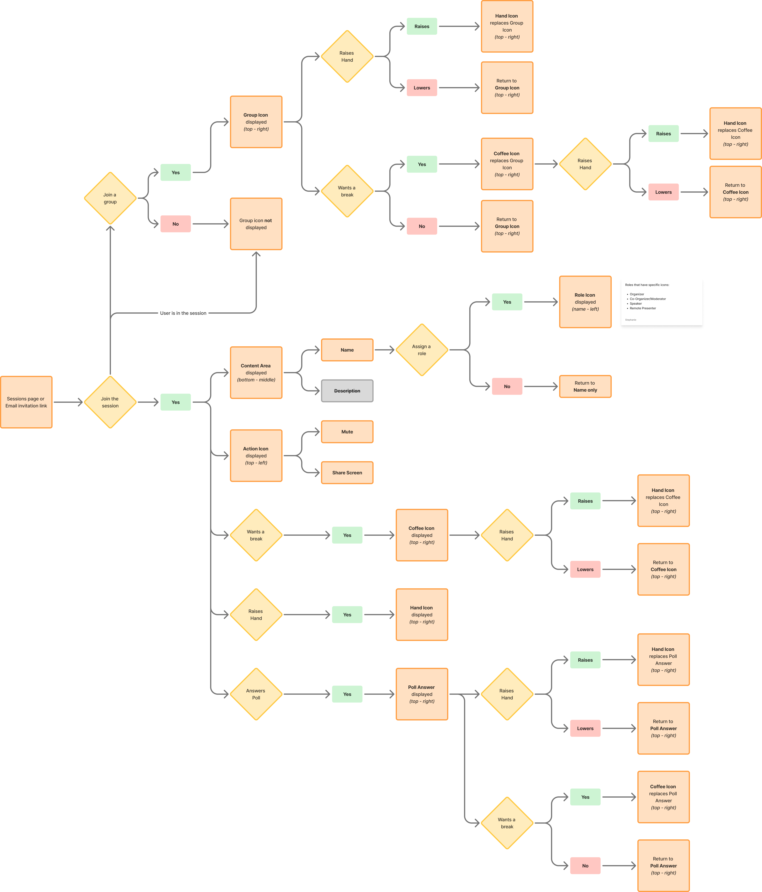
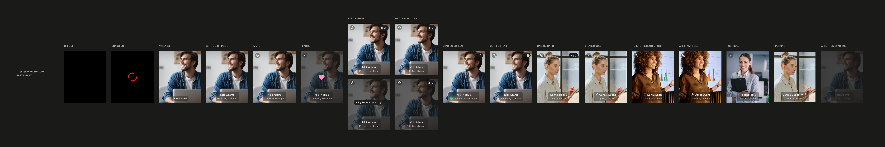

# OneRoom Video Wall: From Proof of Concept to Product Experience

*Designing predictable participant behavior across a real-time hybrid video conferencing system.*

## Overview

OneRoom was a video conferencing solution for hybrid training, designed to bring remote participants into the physical classroom and make them feel more present and engaged in the learning experience. One of its more distinctive features was a video wall: remote participants appeared on individual screens positioned around the physical room, with each screen supporting its own camera, microphone, and speaker.

I was asked to drive the redesign of the remote participant video wall, including its seating model, automation, and interaction behavior. I worked closely with the product designer, backend and frontend architects, product strategist, and our senior training manager to explore the user experience, technical constraints, and what was feasible to build.

The work resulted in a set of product requirements, interaction designs, automation rules, and Figma prototypes intended for further physical-room testing.

## The starting point

The video wall began as an early OneRoom concept developed with two early customers. The idea was straightforward: rather than appearing as a grid of small video tiles, remote participants would occupy physical positions around the room.

If someone in the room walked toward a particular screen and spoke to the person displayed there, the interaction could feel much more like speaking to someone who was physically present.

Behind the scenes, however, the system had to manage considerably more than displaying video.

Remote participants were assigned "seats" and remained pinned to that position on the wall. A moderator could move participants manually, and an in-room host could also manage seating from an iPad. The seating chart represented the broader room, including in-room participants and a designated remote presenter position.

The original implementation worked, but I viewed it as effectively still a proof of concept. As the product was used in real sessions, a number of usability and operational problems became apparent.

## The problems we needed to solve

**Empty seats made the wall look unfinished**

When a session started, every screen could be activated even if the corresponding participant had not joined. Unoccupied positions could display an avatar, a darkened participant photo (if one existed), or the OneRoom logo.

The result could be a video wall with occupied and unoccupied positions scattered throughout it.

We wanted the wall to communicate the state of the session more naturally:

Participants should occupy the center of the wall, with empty positions pushed toward the edges.

That simple visual principle became one of the foundations of the redesign.

**Participant movement was entirely manual**

When someone dropped from the session and did not return, the host or moderator had to manually fill the vacant seat by moving someone from Overflow or another position on the wall.

It could take time for someone to notice the vacancy, and if there was no moderator available or the host was occupied with the session, the seat could remain empty.

**It was difficult to identify the active speaker**

With participants distributed across a large physical wall, particularly in the corners or on higher screens, it wasn't always obvious who was speaking.

The remote participant experience already had mechanisms for identifying speakers, but those mechanisms did not necessarily translate well to the physical room.

**Important interactions could be missed**

Hand raising was an important part of the controlled-participation model. A remote participant could raise their hand and wait for the host to interact with them.

In the physical room, however, a host might not notice a raised hand on a distant screen. People in the room sometimes had to alert the host.

**Audio and positioning were connected**

Moving a participant from one position to another could also affect the physical relationship between the participant's audio and visual presence.

The system therefore couldn't treat seating as merely a display decision. Position was part of the communication experience.

**Remote and in-room experiences had evolved separately**

The remote participant application already contained a substantial interaction model: speakers, hand raising, roles, presenters, layouts, and other session states.

The physical video wall represented many of the same participants, but the two experiences did not always behave consistently.

For example, the remote interface included a "last four speakers" area that was automatically populated based on speaking activity. There was no equivalent representation on the physical wall.

The redesign was an opportunity to bring these experiences into better alignment.

## From a video wall to a participant system

One of the things that became clear as we worked through the problem was that the video wall wasn't really a standalone feature.

It was one representation of a larger session.

The same underlying participant objects were already being represented in different places in the product. A participant could have a role, a position, a speaking state, a raised hand, presenter status, and other session attributes.

That meant the opportunity wasn't to invent a separate video-wall model. It was to make better use of the existing participant and session model and define how changes in that model should be reflected across the different surfaces.

A participant might:

* Join the session
* Receive an assigned seat
* Raise a hand
* Become a Speaker
* Become a Remote Presenter
* Temporarily disconnect
* Reconnect
* Leave permanently
* Be moved manually by a moderator

Each of those events could affect both the digital participant experience and the physical room.

That made predictable state transitions a central part of the design.

## Designing predictable seating

The core seating principle became:

Participants fill from the center outward as they connect to the session. Empty seats remain at the edges.

This sounds simple but implementing it required us to define what should happen in a range of situations.

**New participants**

When a remote participant joined, they received the nearest available seat to the center.

Existing participants were not reshuffled simply because someone new joined.

This created a predictable experience for both sides of the system: participants knew roughly where they would appear, and people in the physical room weren't watching the entire wall rearrange every time someone joined.

**Elected speakers**

Speakers were treated differently.

If a participant was elected as a Speaker, they moved toward the center of the wall.

If the target center seat was occupied, the system performed a one-to-one swap rather than triggering a cascade of movements.

This established another simple rule:

*If I become a Speaker, I move to the center.*

The goal was to make the physical positioning meaningful rather than arbitrary.

## Smart Seat Filler

One of the larger pieces of the redesign was what I called the *Smart Seat Filler*.

The video wall had a defined physical layout, with numbered participant seats distributed across multiple screens.

Participants could leave a seat vacant for several reasons:

* A participant permanently disconnecting
* A Remote Presenter leaving the video wall
* A Speaker swap
* A moderator manually moving someone
* Another role change

Rather than treating each situation as a separate problem, we developed a common model for filling the resulting vacancy.

The preferred sequence was:

1. Place an available participant from Overflow into the vacant seat.
2. If there was no Overflow participant, move a participant from the far edge inward.
3. Leave the newly vacated edge position empty.

The important constraint was minimal movement.

We explicitly wanted to avoid the common approach of shifting everyone along the wall to close a gap. The system should make the smallest possible change to the existing arrangement.

In other words, a vacancy should cause one meaningful movement, not a chain reaction.

## Temporary disconnects

A particularly important edge case was a participant who temporarily lost their connection.

If the system immediately treated that seat as vacant, another participant could move into it. If the original participant then reconnected, the system would have to move people around again.

Instead, we defined a temporary grace period.

During that period:
* The participant's seat remained reserved
* The seat was excluded from new assignments
* No other participants moved
* The participant could reconnect to the same position

If the grace period expired, the seat became available and the Smart Seat Filler rules took over.

This was a small example of a larger principle: the system should distinguish between a temporary state and a permanent state rather than reacting to every event immediately.

## The Remote Presenter

The Remote Presenter introduced another special case.

The presenter had a dedicated position on a screen at the front of the room, separate from the normal video wall.

When a participant became the Remote Presenter:

1. They moved from their video-wall position to the presenter position.
2. Their former wall seat became vacant.
3. The Smart Seat Filler could fill that position.

When the presentation ended, the participant returned to their original position if it was available. Otherwise, they were placed in the nearest available position toward the center.

Again, the objective was predictability without unnecessarily disturbing everyone else.

## Overflow

The seating chart could support a finite number of participants on the video wall.

Rather than allowing the seating logic to break when more people joined, we defined an *Overflow* state.

Overflow participants could be mapped to a designated camera so they could still see the in-room activity, but they would not appear on the physical video wall and would not be heard in the room.

This gave the system a defined behavior beyond its normal capacity instead of treating additional participants as an unexpected condition.

## Designing the information hierarchy

There was another constraint beyond the physical wall itself.

Each participant tile had limited space.

We wanted to communicate things such as:

* Name
* Speaking status
* Mute status
* Raised hand
* Participant role
* Group status
* Break status
* Poll responses
* Reactions

But displaying everything simultaneously would have produced a cluttered interface.

The product designer and I therefore worked through the relative priority of these states and how one indicator should replace another when space was limited.

This was essentially an information hierarchy for a constrained interface.

The physical video wall presented the same problem at a larger scale: there was only so much visual information that could be communicated without undermining the experience of actually being in a room with other people.

## The underlying technical challenge

The visible feature was relatively simple: show remote participants on screens.

The engineering problem was not.

The experience depended on coordinating:

* Live audio and video
* Shared session state
* Participant roles and permissions
* Remote participant interfaces
* Physical-room displays
* Seating and positioning
* Real-time events
* Consistent behavior across endpoints

At the time, OneRoom's in-session experience relied on legacy infrastructure (*Epoxy*, which was a beast!) for live media, participant identity, and session lifecycle. As the product evolved, this created architectural coupling that limited flexibility.

The development team was beginning to explore LiveKit as a replacement for the real-time media layer. One of the product-level architectural questions we worked through was the distinction between media transport and product logic.

LiveKit could provide the media transport and basic room functionality. It did not define OneRoom's product-specific session behavior, roles, permissions, or authoritative state.

The direction I proposed was therefore:

LiveKit → media transport

OneRoom product layer → session logic and shared state

This distinction mattered because the frontend and backend teams needed to be able to work in parallel without making contradictory assumptions about where the source of truth lived.

## Defining the MVP

The goal wasn't to solve every possible real-time collaboration problem at once.

We identified several assumptions that needed to be stable for development to proceed:

* One authoritative session state
* Live, ordered state changes
* Defined participant roles
* In-room displays acting as read-only reflections of session state
* LiveKit functioning as the media layer rather than the product's source of truth

Other details could remain flexible while development progressed, including deployment details, performance tuning, advanced moderation, full breakout functionality, and more sophisticated reconnection behavior.

This allowed the frontend team to work on the experience using mocked session state while backend work proceeded on the session model and LiveKit integration.

The objective of the MVP was therefore not feature completeness. It was to validate the experience and the underlying architectural approach.

## From requirements to prototype

The work was deliberately iterative.

I worked with the product designer to develop the interaction model and Figma prototypes while we discussed feasibility with developers and our senior training manager.

The prototype became a way to work through how different participant states would be represented on the video wall. Each participant could have multiple states at once, including role, speaking status, mute status, hand raised, reactions, poll responses, or a temporary status such as needing a coffee break.

Rather than designing each state as an isolated screen, we treated the participant tile as a common component with a set of possible states and modifiers. This helped us identify conflicts and establish rules for how information should be presented when multiple conditions occurred at once.

The first prototypes were intended to be tested in the physical room.

That was important because some questions could not be answered adequately on a computer screen. We needed to see:

* How the participant positions actually looked at room scale
* Whether visual indicators were readable
* How the center-out seating pattern felt
* How role changes affected the wall
* Whether the physical positioning supported the intended sense of presence

*Figma exploration of participant states and combinations. The prototype was used to identify competing states, establish information hierarchy, and explore how participant status could be communicated consistently across the video wall.*

The prototype was therefore not presented as the final design. It was a way to make the proposed behavior tangible enough to evaluate, discuss, and refine before implementation.

## My role

I was responsible for driving the video-wall work from the product side.

My responsibilities included:

* Defining the problem and desired experience
* Writing the epic and product requirements
* Developing user stories around the seating and automation behavior
* Working with developers to understand technical feasibility
* Collaborating with Product Design on Figma prototypes
* Defining state transitions and edge cases
* Establishing the seating and automation rules
* Considering the relationship between remote and in-room experiences
* Helping define the product-level boundaries around the real-time architecture
* Working with our senior training manager to incorporate the practical session experience

The work was collaborative. I wasn't designing the underlying real-time infrastructure myself. My contribution was defining the product behavior and the boundaries and assumptions Engineering needed in order to build it coherently.

## What happened next

We were still in the early stages of validating the redesigned experience when the company ceased operations.

The Figma prototypes had not yet gone through the planned physical-room validation, and the redesigned video-wall behavior was not implemented in production.

There are therefore no meaningful adoption or performance metrics to report.

What remains is the product work itself: the problem analysis, interaction model, automation rules, requirements, architectural assumptions, and prototypes.

## What this project demonstrates

This project is a good example of the kind of product work I enjoy most: taking a complicated, partially defined experience and making its behavior explicit.

It required more than writing requirements. I had to think about people, interfaces, physical space, real-time state, technical constraints, and edge cases as parts of one system.

The final design principle was deceptively simple:

Make participant movement predictable, meaningful, and minimal.

Getting to that principle required working through the many ways a participant could enter, leave, move through, or change roles within a live hybrid session.

And that, ultimately, was the purpose of the redesign: to turn a promising proof of concept into a more coherent product experience.

## Acknowledgements

Thank you:

* Ashley
* Dave
* Jo
* Julien
* Kristof
* Sacha

*I really enjoyed working on OneRoom with you.*

So long, and thanks for all the tea.
